# POS Management System

A web-based **Point of Sale (POS) Management System** developed using **Laravel, PHP, Bootstrap, JavaScript, and MySQL**.

The system provides a modern POS dashboard and purchasing management interface with database integration, purchase returns, file upload, and administrator management.

---

## Project Overview

The main objective of this project is to develop an independent Laravel-based POS Management System with a clean and user-friendly interface.

The system currently focuses on the dashboard and purchase management section.

### Implemented Areas

- Home Dashboard
- List Purchases
- Add Purchase
- View Purchase
- Edit Purchase
- Delete Purchase
- Search Purchases
- Purchase Returns
- Purchase Return Reason
- Purchase File Upload
- File Download
- File Delete

The project follows the **Laravel MVC architecture** and uses **MySQL** for persistent data storage.

---

# Technology Stack

## Frontend

- HTML5
- CSS3
- Bootstrap 5
- Bootstrap Icons
- JavaScript

## Backend

- PHP
- Laravel Framework
- Laravel MVC Architecture
- Eloquent ORM

## Database

- MySQL
- Laravel Migrations
- Eloquent Relationships
- Database CRUD Operations

## Development Tools

- Visual Studio Code
- Composer
- Node.js
- NPM
- Git
- GitHub
- XAMPP
- PHP

---

# Implemented Modules

The POS Management System currently includes the following implemented modules and interfaces.

---

## 1. Home Dashboard

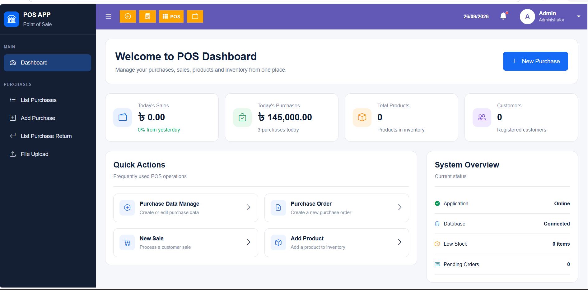

The Home Dashboard provides an overview of the POS system.

It includes:

- Sales overview
- Purchase overview
- Product overview
- Customer overview
- Quick Actions
- System Overview
- Recent Purchases
- POS navigation
- Purchase shortcuts
- Notification button
- Administrator profile menu

The dashboard provides a centralized starting point for accessing the major functions of the application.

---

## 2. List Purchases

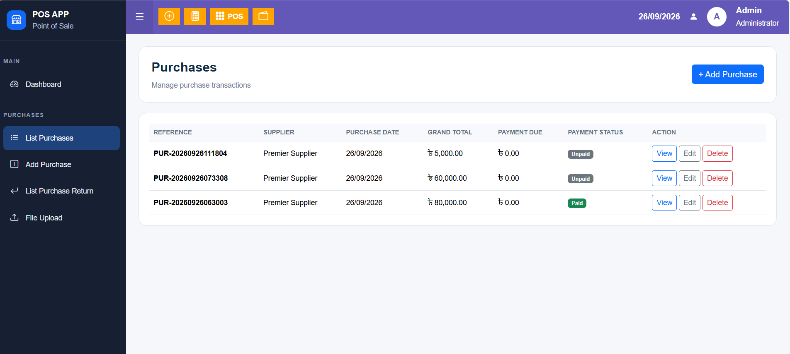

The List Purchases page displays all available purchase records in a structured table.

The page includes:

- Purchase reference number
- Supplier
- Purchase date
- Status
- Payment status
- Grand total
- Payment due
- View action
- Edit action
- Delete action
- Pagination

The page provides an organized interface for managing existing purchase records.

---

## 3. View Purchase

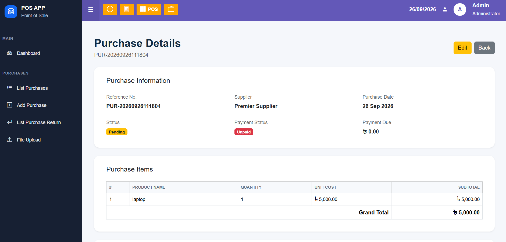

The View Purchase page displays detailed information about a selected purchase.

It includes:

- Purchase reference number
- Supplier
- Purchase date
- Purchase status
- Payment status
- Grand total
- Payment due
- Notes
- Purchase items

The page allows users to review the complete purchase information.

---

---
## 4. Edit Purchase

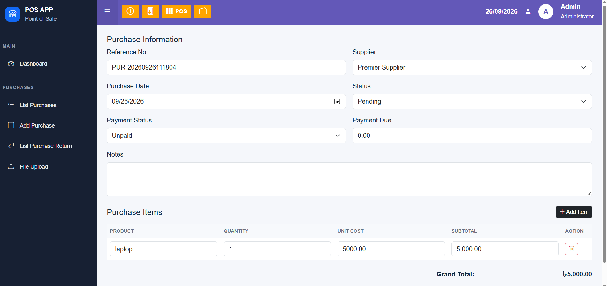

The Edit Purchase page allows administrators to update existing purchase information.

Users can modify:

- Supplier
- Purchase date
- Status
- Payment status
- Purchase information
- Notes

The existing purchase information is loaded automatically into the edit form.

---

## 5. Add Purchase

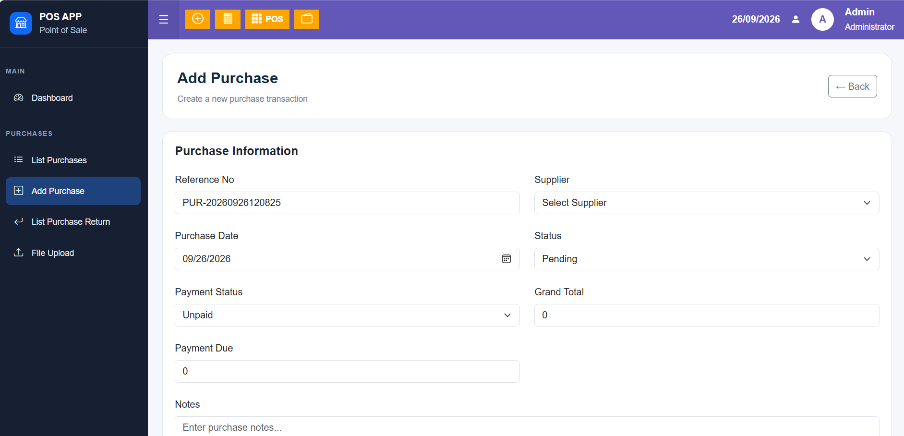

The Add Purchase page provides an interface for creating a new purchase.

The purchase form includes:

- Reference number
- Supplier
- Purchase date
- Status
- Payment status
- Grand total
- Payment due
- Notes
- Purchase items

Purchase items include:

- Product name
- Quantity
- Unit cost
- Subtotal

---

## 6. Purchase Items

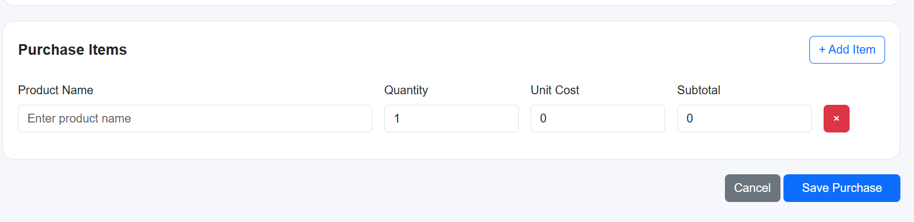

Each purchase can contain multiple purchase items.

The purchase item system stores:

- Product name
- Quantity
- Unit cost
- Subtotal

Each purchase item is connected to its parent purchase using a database relationship.

The structure is:

Purchase

→ Purchase Item

→ Purchase Item

→ Purchase Item

---

## 7. Delete Purchase

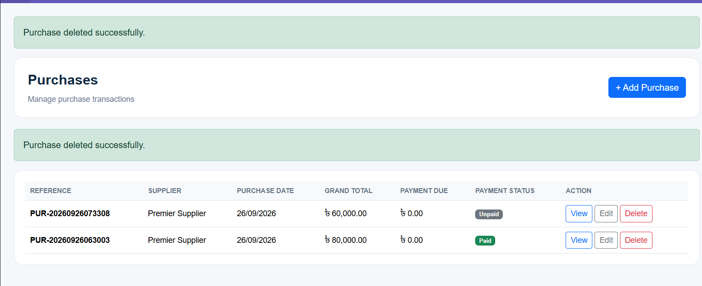

The system provides a delete function for removing purchase records.

When a purchase is deleted, its related purchase items are also removed through the database relationship.

The application uses Laravel and database cascade deletion to maintain data consistency.

---

## 8. Purchase Return

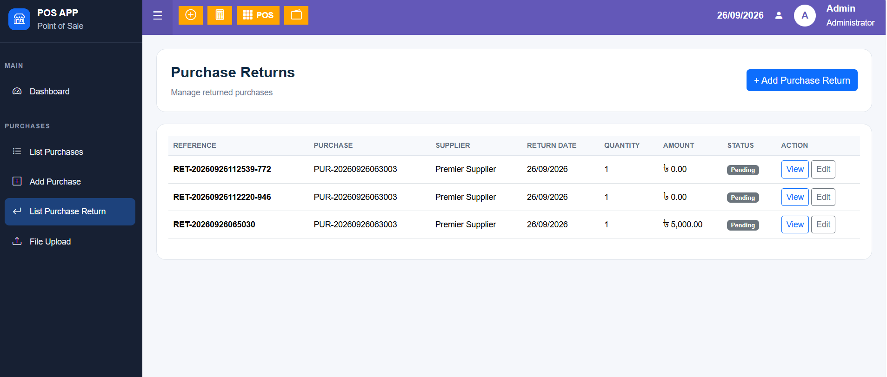
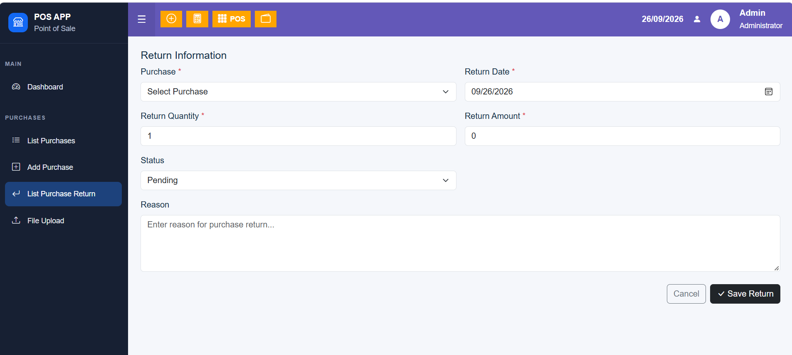

The Purchase Return module allows administrators to manage returned purchases.

The system stores:

- Purchase
- Return reference number
- Return date
- Quantity
- Return amount
- Reason
- Status

The default return status is:

`Pending`

---


## 9. Purchase File Upload

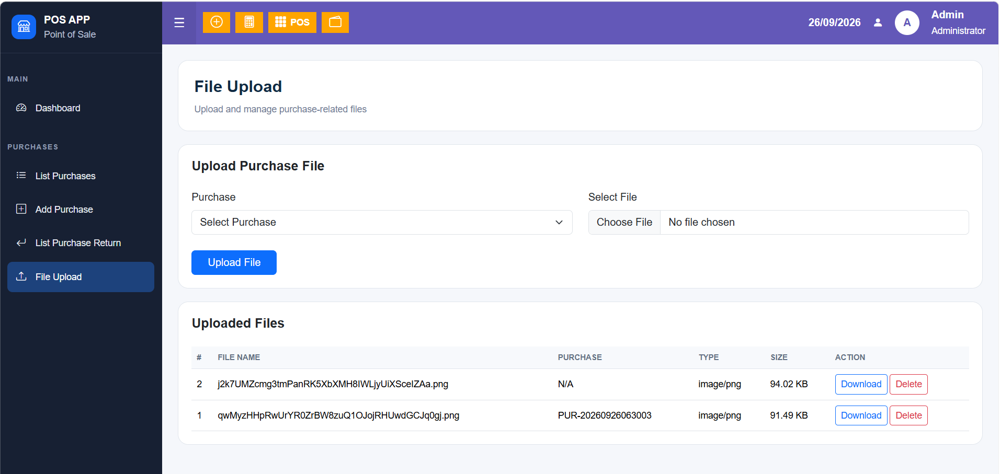

The Purchase File Upload module allows users to upload files related to purchase records.

The module provides:

- File upload
- File listing
- File storage
- Purchase file association
- File management

This can be used for storing purchase-related documents and supporting files.

---

## 10. Purchase File Download

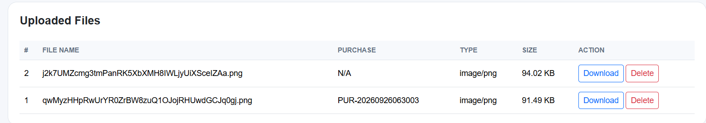

Uploaded purchase files can be downloaded from the File Upload section.

The download functionality allows users to retrieve previously uploaded purchase documents.

---

## 11. Purchase File Delete

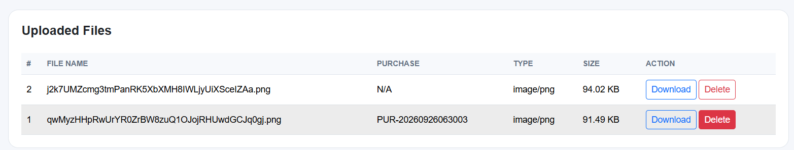

The system also provides a delete option for uploaded purchase files.

Administrators can remove files that are no longer required.


---

## 12. Admin Dropdown

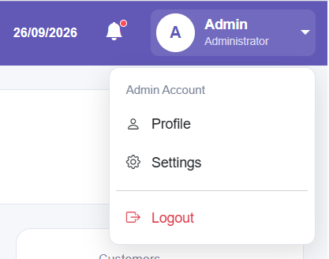

The administrator button in the top navigation provides a dropdown menu.

The dropdown includes:

- Profile
- Settings
- Logout

---

## 13. POS Navigation Bar


The POS interface includes a navigation bar for quickly accessing important system functions.

The navigation includes:

- Dashboard
- Purchase shortcuts
- Calculator
- POS button
- Notification button
- Date
- Administrator account

---

## 14. Calculator

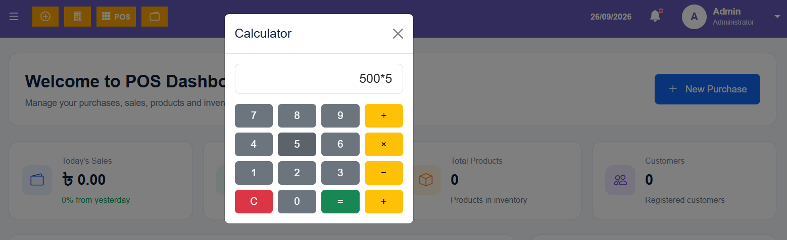

The navigation bar includes a calculator interface for performing basic calculations.

The calculator supports:

- Addition
- Subtraction
- Multiplication
- Division
- Clear
- Result calculation

The calculator is designed to provide quick calculations while working with POS transactions.

---

## 15. Notification Button

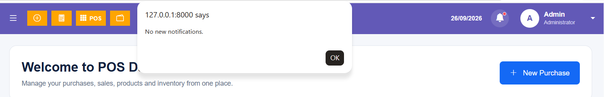

The top navigation includes a notification button.

The notification interface provides a location for displaying system notifications.

The notification functionality can be expanded in future development to display:

- New purchases
- Purchase returns
- Stock alerts
- Payment notifications
- Other system events

---

# Database Structure

The main database tables used by the purchase management system include:

```text
purchases
purchase_items
purchase_returns
purchase_files
suppliers
users
